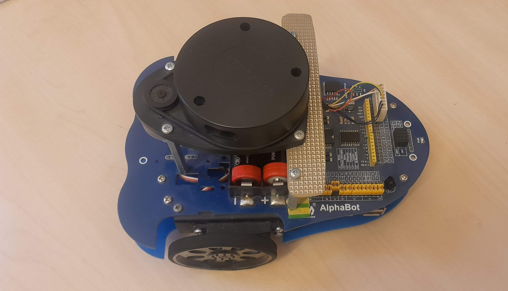

# Alphabot

## Hardware 



- AlphaBot mobile robot development kit by Waveshare https://www.waveshare.com/alphabot-robot.htm. 
- 360 degree 2D laser scanner, RPLIDAR A1MB by Slamtec https://www.slamtec.com/en/Lidar/A1/
- Continuous rotation servos by Parallax https://www.parallax.com/product/parallax-continuous-rotation-servo/
- Raspberry Pi 3 Model B https://www.raspberrypi.com/products/raspberry-pi-3-model-b/

## Software

### Prerequisites 

This software requires Raspbian/Debian bullseye.

Install the following SDKs:

- Servos - [sdk](sdk)
- Lidar - [rplidar_rpi](rplidar_rpi)

### Compile 

Generate the build files

```cmake .```

Compile the program

```make```

### Run

```sudo ./autoctrl```
