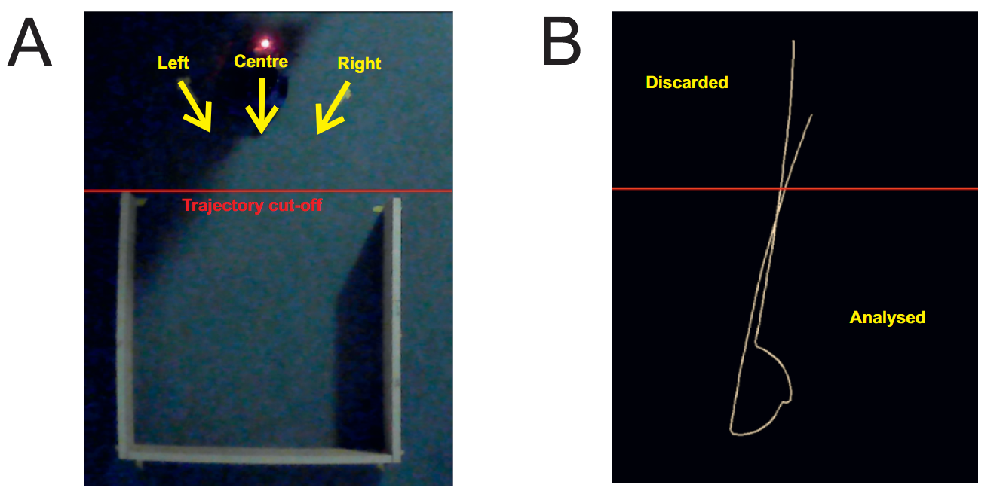
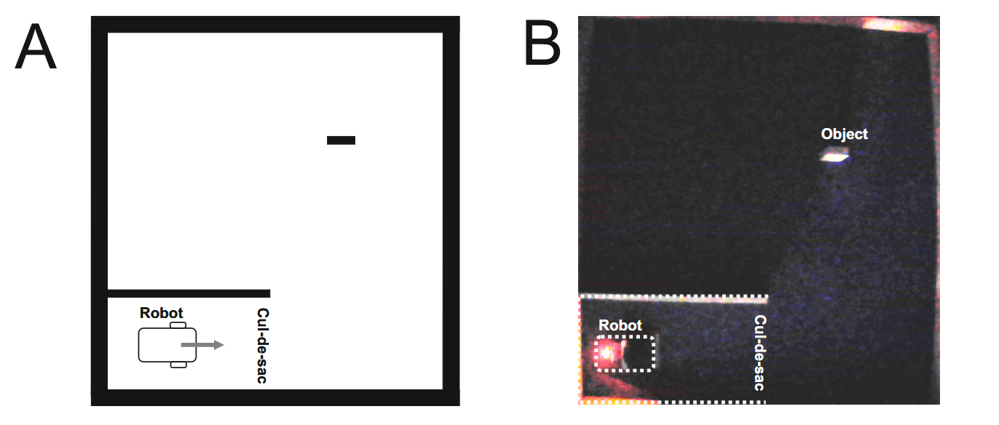

# Data availability

The repo containing raw data for this analysis is available to download [here](https://doi.org/10.5525/gla.researchdata.2012).  Relevant collected data is located in subfolder `case_study_1` of the data repository. Curated datasets used for the analyses are available on this repo. 

# Steps to reproduce

The recommended workflow for collecting new data and generating results is illustrated below:


## Collect data

Our analysis runs two experiments, one in a cul-de-sac scenario and one in a playground environment with one free-standing object and a cul-de-sac.  Each experiment has a unique design but collects similar data uaing a built-in logger and an external camera.  

### Cul-de-sac

As shown in the figure below (panel A), our cul-de-sac experiment has a 3x2 design:



We collected 15 runs for every method x starting position group resulting in 90 runs in total.  The robot is instrumented to produce a log `autoctrl.txt`, data dumps for model checking memory usage at runtime  `dfs<SCAN_INDEX>.dat`, proces memory usage stats from the linux top utility in `usage.txt`.  In a addition, our analysis requires a video of each run in `.mp4`.  Note that the robot should have an LED on it which is significantly brighter than the environment to make later trajectory extraction using the optical flow in OpenCV more reliable.

### Playground

The same data is collected in our playground experiment (shown below), except using a different design.  



We collected 2 runs for each method, resulting in 4 runs.  For precise details on  experimental protocol see our paper. 

## Clean data

For compatibility with data cleaning scripts, the data should be stored in a folder with the following structure:

```
/data
     |___/cul-de-sac
     |       |___/0000
     |	     |___ ...
     |	     |___/2114
     |___/playground
             |___/01
	         |___/02
	         |___/11
             |___/12
```

There is a subdirectory for each scenario which in turn contains subdirectories for each run. The encoding for the run directories for each scenario have the meaning below.  We recommend following this same encoding scheme as our cleaning scripts expect them. 

 Cul-de-sac run directory encoding (`PMRR`):

| Character(s) | Meaning | Values |
|---|---|---|
| 1st digit (`P`) | Starting position |  `0` = Centre, `1` = Right, `2` = Left |
| 2nd digit (`M`) | Method | `0` = Baseline, `1` = Model Checking |
| 3rd–4th digits (`RR`) | Run number (zero-padded) | `00`–`14` (15 runs per group) |

 Playground run directory encoding (`MR`):

| Character(s) | Meaning | Values |
|---|---|---|
| 1st digit (`M`) | Method | `0` = Baseline, `1` = Model Checking |
| 2nd digit (`R`) | Run number | `1`–`2` (2 runs per method) |

### Clean trajectories

Extracting trajectories and preparing them for analysis involves the following steps:

1) Extract trajectories from `.mp4` using `robotracker.py` with the output saved in the same directory.  Note that you will have to adjust the crop settings in the script to focus on the scenario appropriately.   

2) For the cul-de-sac scenario, use `cul-de-sac/clean_traj.ipynb`.  In the top cell, set the variable `repo` to `<path to your repo>/cul-de-sac`.  Then for each run, execute individual cells manually as this part of the process is semi-manual.  This is because the optical flow method in OpenCV is not completely reliable, so requires some human oversight.  For each run you wiil:

    - Set the number of collisions observed during the run and show the 1stFrame of the run and generated trace output by the `robotracker.py` script which implements the optical flow method.  Prior to continuing with the analysis, adjust the `cutoff` variable in the first cell of the notebook until it rests at the entrance of the cul-de-sac for consistency.

    - Load the coordinate data from the run directory which will print the shape of the data.  If the number of columns > 2, then the optical flow method has picked up extra points, so the correct trajectory will need to be manually selected.  If this is the case, in the next cell run `df.plot()` to generate a line plot of all the columns.  As the robot is the only moving object in the scene, extra points typicaly have no variance so are easy to identify. Select relevant columns: 
    
        ``` python
        # 1 = x  2 = y
        df = df.iloc[:, :2]
        df.columns = ['x', 'y']
        ```
    -  Plot the trace coordinates.  This will include a red trajectory cutoff line for reference.  This can be cross-referenced with the trace image for the run to ensure it looks the same, especially if some columns had to be dropped previously.
    - Truncate all aspects of the trajectory greater than the cutoff (note that the cutoff is in pixels starting at the top left corner of a scene).  It is also a good idea to plot the new coordinates as a quick sanity check every worked as planned. 

        ``` python
        df = df[df.y > cutoff]
        draw_coords(df, cutoff)
        ```
    - Save coordinate data for the truncated trajectory to `<run>_coord.csv` in the run directory. 
    - Save the compiled data required for building the dataset in `<run>.json` which has the following data:

        | Field | Type | Description |
        |---|---|---|
        | `collisions` | `int` | Number of collisions observed during the run |
        | `traj_length` | `float` | Calculated length of the trajectory |
        | `method` | `str` | Method used (`single` or `multi`) |
        | `position` | `str` | Robot starting position |
        | `run` | `int` | Run number within the group |

    All relevant code for this is provided in `cul-de-sac/clean_traj.ipynb`. We reiterate that this process needs to be followed for each run as optical flow in OpenCV is not reliable enough for the process to be fully automated. 


## Build datasets

## Run analyses


<!-- # cul-de-sac

This folder contains analysis scripts and jupyter notebooks for the cul-de-sac scenario.  The analysis assumes that there is a repository of raw data in some directory `repo` and outputs all interim files to the repository during cleaning.  


## Trajectory preparation

First we run `python robotracker.py repo/run/run` to extract the trajectory for a run using the optical flow method in OpenCV.  Note that the path to the run video excludes the file extension `.mp4`.  As the optical flow method can be sensitive to light conditions, the process for extracting and cleaning trajectories for analysis is semi-automatic.   Visual inspection is necessary for precision.  

Running the `robotracker.py` script outputs three files into the directory `repo/run`: 

- `run_coord.txt`
- `run_trace.png`
- `run_1stframe.png`

Once these files have been generated, it is then possible to load the trajectory using `clean_traj.ipynb`, manually inspect and clean it then write the final trajectory to `repo/run/run_coord.csv`.  Cleaning involves removing additional points that may have been picked up by the optical flow method in OpenCV and truncating so all trajectories start and end at the same entrance to the cul-de-sace.  We also specify the number of collisions observed and add this to run metadata in `repo/run/run.json`. This is repeated for each run. 

## Extracting and cleaning log data

Once the trajectories have been extracted, we then use `clean_logs.ipynb` to extract relevant data and add it to `repo/run/run.json`.  Specifically, this extracts plan data, model checking memory usage, and process memory useage. Note that this is fully automated.  

## Building the dataset

Once the above steps have been done, we then run `python build_dataset.py` to iterate through all runs in `repo` and build a dataset, output as a `.csv` file. We have included `DATASET.csv` which is the dataset we used for analysis.  

## Running analysis

It is then possible to run `analysis.ipynb` to generate results.  

# playground

This folder contains analysis scripts and jupyter notebooks for the playground scenario, which again assumes there is a repository of raw data in some directory `repo`.  

Data is available at: TODO!

### Trajectory preparation

First we run `python robotracker.py repo/run/run` to extract the trajectory for a run using the optical flow method in OpenCV, as for the cul-de-sac scenario.  In this case, we are interested in `run_trace.png` as a visual representation of the trajectories for comparison.  This aspect is again done manually, however there are only two comparisons in this case.  We also view the video of the run `repo/run/run.mp4`, manually count the number of times the cul-de-sac feature is visited and time spent inside it.  

### Extracting and cleaning log data

As above, we extract and clean log data using `clean_logs.ipynb` and generate three files:

- `repo/run/runmodel_check.csv` : model checking memory usage
- `repo/run/runusage.csv` : process memory usage (model checking and baseline)
- `repo/run/runplan.csv` :  model checking plan data

### Running analysis

As there are only two comparisons, we run `analysis.ipynb` using the data directly from `repo`.  -->
  


